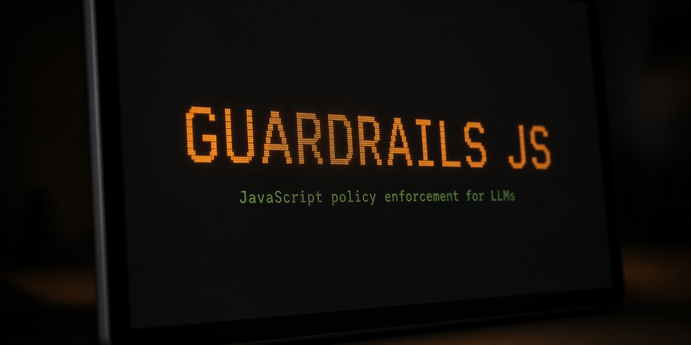

<p align="center">
  
</p>

<h1 align="center">🛡️ guardrails-js</h1>

<p align="center">
  <b>Claude writes the SQL injection. This catches it before you ever see it.</b>
</p>

<p align="center">
  <a href="https://github.com/subhashdasyam/guardrails-js/actions/workflows/ci.yml"></a>
  
  
  
  
  
</p>

A Claude Code plugin that reads every file Claude writes, spots the unsafe and slow patterns, and tells Claude to fix them. In the same turn. Before the code reaches you.

---

## 😬 The 20 seconds this saves you

You ask for an endpoint. Claude writes this:

```js
app.get('/user', async (req, res) => {
  const rows = await pool.query(`SELECT * FROM users WHERE id = '${req.query.id}'`);
  res.json(rows);
});
```

The file lands. Then, without you doing anything:

```
guardrails-js found 1 issue in api.js that needs fixing before you move on:

1. SQL-01 [HIGH | OWASP A05:2025 | CWE-89] line 6
   SQL string is built from req.query.id. A value like "' OR 1=1 --" changes the query.
   found: `SELECT * FROM users WHERE id = '${req.query.id}'`
   fix: pool.query('SELECT * FROM users WHERE id = $1', [req.query.id])
```

Claude reads that and rewrites it. You watch the corrected version appear. 🎯

---

## 🔬 Why not just tell Claude to write secure code?

Because it agrees with you and then does it anyway on the next file.

This does not ask nicely. It parses what was actually written, tracks where request data flows, and reports what it finds. **87 rules**, each mapped to [OWASP Top 10:2025](https://owasp.org/Top10/2025/) and CWE.

Three hooks do the work:

🌱 **Session start.** Reads your `package.json`, works out your stack, and hands Claude a short rule set for that stack only. A Vue project never gets React rules. It also flags what is already broken: a missing lockfile, a known compromised dependency.

🔍 **After every file write.** A regex pass runs first. Nothing matches, the hook exits having done almost no work. Something matches, it parses the file properly and tracks the taint. Critical and high findings go back loud so Claude rewrites them. Everything else arrives as a quiet note. The scan runs in the background and never makes Claude wait.

🚧 **Before every `npm install`.** Checks the name against a known-bad list, measures how close it is to a popular package, looks at whether it is already in your lockfile, and asks osv.dev whether that exact version has a published problem.

---

## 🚨 The osv.dev check, and why most tools get this wrong

This is the part worth reading.

`npm install lodash@4.17.11` passes every offline check anyone would write. lodash is real. The name is spelled correctly. It is one of the most installed packages on earth. Nothing about it looks wrong.

It also has **seven known advisories, one of them CRITICAL**.

So before a pinned install runs, guardrails-js asks osv.dev:

```
guardrails-js flagged this install (lodash):
  - lodash@4.17.11 has 7 known advisories with a fix available,
    worst is CRITICAL GHSA-jf85-cpcp-j695. Upgrade to 4.17.12 or later.
  - this project has no lockfile, so the exact versions installed are not recorded anywhere

Installing runs the package's install scripts on your machine straight away.
Approve only if you recognise the package.
```

### 🧠 The part that took real work: only advisories you can act on

Here is where a naive version becomes useless.

Ask osv.dev about `lodash@4.17.21` and it returns three advisories. Fire a prompt on that and you have just interrupted someone installing the most ordinary package in the ecosystem. Do it twice and they stop reading your prompts forever.

Look at what those three advisories actually say:

| Advisory | Severity | Fixed in |
|---|---|---|
| GHSA-f23m-r3pf-42rh | MODERATE | 4.18.0 |
| GHSA-r5fr-rjxr-66jc | HIGH | 4.18.0 |
| GHSA-xxjr-mmjv-4gpg | MODERATE | 4.17.23 |

When 4.17.21 was the newest lodash in existence, **none of those versions were published**. There was nothing to upgrade to. Reporting them would have been noise with no action attached.

So the check asks the registry what the latest published version actually is, and keeps only advisories fixed at or below it. Same data, opposite answer, depending on a fact that changes over time. 🕰️

The rule pays off in both directions:

- 🛑 `lodash@4.17.11` → seven reachable fixes, worst CRITICAL → **blocked**
- 🤐 `lodash@4.17.21` back when 4.17.23 did not exist → nothing reachable → **silent**
- 🛑 `lodash@4.17.21` today, now that 4.18.1 is out → reachable HIGH → **blocked, and it names 4.18.0**
- 🤐 `npm install express` unpinned → resolves to latest, nothing reachable → **silent**

### 🛑 Why it blocks instead of asking

This is the one place the plugin stops you rather than advising you, and it took a real miss to get here.

The gate used to answer `permissionDecision: "ask"`. A hook's `ask` is not a gate. Claude Code weighs it against your permission rules, so a line as ordinary as this in your `settings.json`:

```json
"allow": ["Bash(npm:*)"]
```

silently swallowed it. `npm install lodash@4.17.17` with six known advisories installed with no prompt, no message, nothing. The single most important check in the plugin was off for anyone who had ever clicked "don't ask again" on an npm command. 😬

Exiting 2 is documented to stop the call **before** permission rules are read, so that is what a genuine gate uses now:

| Signal | What happens |
|---|---|
| Known compromised release on the denylist | 🛑 Blocked |
| Advisory rated CRITICAL or HIGH **with a reachable fix** | 🛑 Blocked |
| Typosquat, unpinned, unknown name, no lockfile | ❓ Prompt |
| Everything else worth a word | 💬 Note to Claude |

Blocking only ever fires when there is somewhere to upgrade to, so Claude reads the reason and installs the fixed version in the same turn, which is the whole point.

Need a version anyway? That is the one way past:

```json
{ "allowPackages": ["lodash@4.17.21", "some-package"] }
```

A bare name covers every version of it. An exact pin covers only that one. Allowing it silences the block, not the reason, so you still see why. ⚠️

### ⚙️ How it behaves

| | |
|---|---|
| When it runs | Only on installs pinned to an exact version, or when a prompt was already going to appear |
| Cost | About 800 ms, once, then cached |
| Timeout | 2 seconds, and a failure falls back to the offline verdict without a word |
| Privacy | Package names go to `api.osv.dev` and `registry.npmjs.org`. Nothing else leaves your machine, ever |
| Off switch | `"network": false` in `.guardrails-js.json`. The offline checks keep working |

Fourteen tests cover it, all against a stubbed fetch, so they need no network and cannot quietly pass by timing out. 🧪

---

## ⚡ Install

```
/plugin marketplace add subhashdasyam/guardrails-js
/plugin install guardrails-js@guardrails-js
```

That is the whole setup. **It asks you nothing**, and the defaults are the shipped behaviour. **Zero runtime dependencies.** The parser is bundled into `dist/`, which is committed, so a clone is all it takes. No install step, no network, nothing to break behind a corporate proxy.

Needs Node 20.10 or later. Tested on 20, 22, 24, and 26.

Run `/hooks` to confirm. Three entries should appear under Plugin Hooks.

### 🔄 Keep it updated

To fetch the newest release immediately, run these commands in your terminal:

```bash
claude plugin marketplace update guardrails-js
claude plugin update guardrails-js@guardrails-js
```

Restart Claude Code to load the update.

Automatic updates are controlled per marketplace. Third-party marketplaces start with automatic updates off. To turn them on:

1. Run `/plugin`.
2. Open **Marketplaces**.
3. Select `guardrails-js`.
4. Choose **Enable auto-update**.

Claude checks for marketplace updates after startup. When it reports a new version, run `/reload-plugins` or start a new session. See the [Claude Code plugin guide](https://code.claude.com/docs/en/discover-plugins) for the full update behaviour.


### 🩺 If nothing seems to happen

Run `/guardrails-js:doctor`. It checks whether the hooks can actually run and tells you what to do.

The hooks are Node scripts. Claude Code spawns `node` directly with the script path as its argument:

```json
{ "command": "node", "args": ["${CLAUDE_PLUGIN_ROOT}/dist/pre-bash.mjs"] }
```

**No shell is involved.** Not `sh`, not PowerShell, not Git Bash. That is deliberate: PowerShell is blocked by policy in plenty of enterprises, and a hook that needs it simply never runs there. It also means no quoting, so a plugin path with a space in it cannot break anything.

The one thing it does need is `node` on the PATH Claude Code inherited. If it is not there, the hooks fail to start and the plugin quietly does nothing.

**The usual cause is nvm on macOS or Linux.** nvm is a shell function sourced from `~/.nvm/nvm.sh` by your `.bashrc` or `.zshrc`. A non-interactive shell never reads those. So Claude Code started from a terminal has node, and Claude Code started from the Dock or a desktop launcher does not.

`/guardrails-js:doctor` handles this for you. It finds the node you already have, shows you the one command that fixes it, and verifies the result. You do not have to source anything.

Worth knowing, because it is the part everyone gets wrong: **`nvm.sh` is not what makes node work.** That script only defines the `nvm` shell function and rewrites `PATH`. The binary itself needs none of it and runs from its own path with a completely empty environment. So the fix is never to source a script, it is to make one path reachable:

```bash
# what doctor works out for you, then runs with your approval
sudo ln -sf "$HOME/.nvm/versions/node/v24.12.0/bin/node" /usr/local/bin/node
```

`/usr/local/bin` is on the default PATH on macOS and Linux, including for apps launched from the Dock, which is the case that breaks. This fixes node for every tool on the machine, not only this plugin. Restart Claude Code afterwards, since a running process keeps the PATH it started with.

| | Fix |
|---|---|
| nvm | Run `/guardrails-js:doctor`. Or start Claude Code from a terminal, or move to `fnm`, `volta`, or `asdf`, which install real shims instead of a shell function |
| Homebrew | Node lives at `/opt/homebrew/bin/node` on Apple silicon, `/usr/local/bin/node` on Intel. `brew link node` if it is not on PATH |
| Windows | The official installer puts node on PATH. Check with `where node` in a new terminal. Restart Claude Code after any PATH change, since a running process does not see it. nvm for Windows is a different program and keeps node on PATH already |

> [!WARNING]
> Do not set `PATH` in `settings.json` under `env`. It looks like the obvious fix and it is not. Claude Code writes those values in **replacing** what your shell provided, and it does not expand `${PATH}`, so your session and everything it spawns would be left with only the literal string you wrote.

### ♻️ Uninstall or reinstall

A normal reinstall keeps the marketplace and replaces the installed plugin:

```bash
claude plugin uninstall guardrails-js@guardrails-js
claude plugin install guardrails-js@guardrails-js
```

These commands use user scope by default. If you installed it for one project, add `--scope project` to both commands. For a private install in one project, use `--scope local`.

Uninstalling the last installed scope removes the plugin's persistent data. Add `--keep-data` to the uninstall command if you want to preserve it. Your project-level `.guardrails-js.json` file is not part of that plugin data and is left alone.

If the marketplace itself is stuck, remove and add it again:

```bash
claude plugin marketplace remove guardrails-js
claude plugin marketplace add subhashdasyam/guardrails-js
claude plugin install guardrails-js@guardrails-js
```

Removing a marketplace also removes plugins installed from it. Restart Claude Code after reinstalling.

## 🧰 Installation troubleshooting

The hooks run `node` by name, so Node must be visible on the `PATH` inherited by Claude Code. Start with this in the same terminal where you launch `claude`:

```bash
node --version
```

It must print `v20.10.0` or later. An active LTS release from the [Node.js download page](https://nodejs.org/en/download) is the safest choice. After changing Node or `PATH`, close Claude Code, open a new terminal, check the version again, and then start Claude Code from that terminal.

### 🍎 macOS

**Homebrew.** Install the normal formula unless you deliberately need one pinned major:

```bash
brew install node
node --version
```

If Homebrew is installed but `brew` or `node` is missing in a new terminal, load Homebrew's environment. Use the line for your Mac:

```bash
# Apple Silicon
eval "$(/opt/homebrew/bin/brew shellenv)"

# Intel
eval "$(/usr/local/bin/brew shellenv)"
```

Put the matching line in `~/.zprofile`, or follow the exact shell setup printed by the Homebrew installer. An interactive zsh can also load it from `~/.zshrc`, but only keep one copy. Homebrew documents its supported prefixes and shell setup in its [installation guide](https://docs.brew.sh/Installation).

Versioned formulas such as `node@24` are keg-only and need their own `opt/node@24/bin` directory on `PATH`. `brew install node` avoids that extra step.

**Node website.** Download and run the current LTS macOS `.pkg`, then open a new terminal and run `node --version`. This installation does not use `nvm`, so it does not need an `nvm.sh` line.

**nvm.** Only use the following setup if you installed Node through [nvm](https://github.com/nvm-sh/nvm):

```bash
export NVM_DIR="$HOME/.nvm"
[ -s "$NVM_DIR/nvm.sh" ] && \. "$NVM_DIR/nvm.sh"
nvm install --lts
node --version
```

Put the first two lines in `~/.zshrc` when zsh is your shell.

### 🐧 Linux

For `nvm`, put its loader in the startup file for the shell that launches Claude Code. That is normally `~/.bashrc` for bash or `~/.zshrc` for zsh:

```bash
export NVM_DIR="$HOME/.nvm"
[ -s "$NVM_DIR/nvm.sh" ] && \. "$NVM_DIR/nvm.sh"
nvm install --lts
node --version
command -v node
```

If you downloaded an official Linux archive instead, add the archive's extracted `bin` directory to `PATH`. Do not source `~/.nvm/nvm.sh` unless you actually installed `nvm`. If you use your distribution's Node package, check the version because older distributions may ship a release below 20.10.

WSL follows these Linux instructions.

### 🪟 Windows

Download and run the current LTS Windows `.msi` from the Node.js website. Close every PowerShell, Command Prompt, and Claude Code window after installation, then open a new PowerShell and check:

```powershell
node --version
Get-Command node
```

If Node is still missing, rerun the installer and confirm that Node is added to `PATH`. A standard installation normally exposes `node.exe` from `C:\Program Files\nodejs`.

[nvm-windows](https://github.com/coreybutler/nvm-windows) is a separate Windows project. It does not use `~/.nvm/nvm.sh`, `.zshrc`, or `.bashrc`.

### 🩺 Final checks

List the installed version from your terminal:

```bash
claude plugin list
```

Then run `/hooks` inside Claude Code. You should see SessionStart, PostToolUse, and PreToolUse entries for `guardrails-js`. If they are missing or show an error, open `/plugin`, select **Errors**, and check whether Claude Code can find `node`.

---

## 🧭 Three commands

| Command | What it does |
|---|---|
| `/guardrails-js:audit [path]` | Scan the whole repository, not just what Claude touched |
| `/guardrails-js:report` | Summarise what has been flagged this session |
| `/guardrails-js:doctor` | Check the hooks can actually run, and say how to fix it if not |

And a CLI, for CI:

```bash
node dist/audit.mjs src --format json --fail-on high
```

---

## 🥊 Next to Anthropic's own plugin

Anthropic ships [`security-guidance`](https://code.claude.com/docs/en/security-guidance). You should probably install that too. It solves a different part of the problem, and they use different hooks so they do not fight.

| | security-guidance | guardrails-js |
|---|---|---|
| Runtime | Python 3.10+, pip, Agent SDK | Node only, nothing to install |
| How it detects | substring and regex match | regex first, then a real parser and taint tracking |
| Languages | any language, generic patterns | Node, Express, Fastify, Nest, tRPC, React, Next, Vue, Nuxt, Angular, Svelte |
| npm supply chain | nothing | install gate, known-bad list, typosquat check, live advisories |
| Performance checks | nothing | event loop, concurrency, memory, React and Vue render |
| Dependency CVEs | nothing | Next.js, React Server Components, Nuxt, Vite version checks |
| Model cost | a model call per turn and per commit | none unless you opt in |

---

## 🎯 What it catches

87 rules plus 4 dependency advisories, each mapped to OWASP Top 10:2025, CWE, and where it fits the OWASP API Top 10.

<details>
<summary><b>💉 Injection and interpreters (A05)</b></summary>

| Rule | What it catches |
|---|---|
| SQL-01, SQL-02, SQL-03 | SQL built from request data, raw ORM queries, `$queryRawUnsafe` |
| NOSQL-01, NOSQL-02 | Mongo operator injection, `$where` with user input |
| CMD-01, CMD-02 | `exec` with a built string, `shell: true` on spawn |
| PATH-01, ZIP-01 | Paths from user input, archive entries written outside the target directory |
| SSTI-01 | Templates compiled from user input |
| HTTP-01 | Header injection and open redirects |

</details>

<details>
<summary><b>🔓 Access control and requests (A01)</b></summary>

| Rule | What it catches |
|---|---|
| SSRF-01, SSRF-02, SSRF-03 | User supplied URLs, redirect following, string based host blocking |
| IDOR-01 | Records fetched by id with nothing tying them to the caller |
| MASS-01 | Request body written straight into a model |
| AUTHZ-01 | Sensitive route registered with no middleware |
| CSRF-01 | Cookie authenticated route with no CSRF protection |
| PP-01 to PP-04 | Recursive merge, `Object.assign` from a body, lodash deep merge, computed key writes |

</details>

<details>
<summary><b>🔑 Authentication and cryptography (A04, A07)</b></summary>

| Rule | What it catches |
|---|---|
| JWT-01, JWT-02, JWT-03 | Algorithm not pinned, `decode` used instead of `verify`, `none` allowed |
| AUTH-01, AUTH-02 | Signing key in source, security values from `Math.random` |
| CRYPTO-01, CRYPTO-02 | `createCipher`, fixed IV, ECB and other broken modes |
| PASS-01, PASS-02 | Passwords through a fast hash, bcrypt cost below 10 |
| TIMING-01 | Secrets compared with `===` |
| COOKIE-01, SESSION-01 | Missing cookie flags, session id not rotated at login |
| SECRET-01 | Keys written into source |

</details>

<details>
<summary><b>⚙️ Configuration and resource limits (A02, A10)</b></summary>

| Rule | What it catches |
|---|---|
| TLS-01 | Certificate checking turned off |
| CORS-01 | Any origin allowed with credentials |
| ERR-01 | Stack traces sent to clients |
| PROXY-01 | `trust proxy` set to true |
| REDOS-01 | Regular expressions that can backtrack forever |
| BODY-01, UPLOAD-01 | Body parsers and file uploads with no size limit |
| RATE-01 | Login and password reset endpoints with no rate limit |
| DESER-01 to DESER-04 | `node-serialize`, `vm` and `vm2`, computed `require`, unsafe YAML |

</details>

<details>
<summary><b>⚛️ React and Next.js</b></summary>

| Rule | What it catches |
|---|---|
| XSS-01, XSS-02 | `dangerouslySetInnerHTML` and `innerHTML` with no sanitiser |
| XSS-05 | `eval`, `new Function`, `setTimeout` with a string |
| XSS-06, LINK-01 | Link targets with no protocol check, `target="_blank"` with no `rel` |
| MSG-01 | `postMessage` handlers that never check `event.origin` |
| NEXT-MW | Middleware used as the only auth check, and code trusting `x-middleware-subrequest` |
| SERVER-ACTION | A `'use server'` function with no auth check, which is a public endpoint |
| NEXT-IMG | Image optimizer configured to fetch from any host |

</details>

<details>
<summary><b>💚 Vue, Nuxt, Angular, Svelte</b></summary>

| Rule | What it catches |
|---|---|
| XSS-03 | `v-html` with no sanitiser |
| VUE-URL | A bound `:href` or `:src` with no protocol check |
| VUE-SSR | A Vue template compiled from a string that came from outside |
| VITE-HOST | A dev server bound to every interface |
| NUXT-ROUTE-RULES | Route rules covering a sensitive path, which is rendering config and not authorization |
| NG-BYPASS | `bypassSecurityTrust*` on anything that is not a reviewed constant |
| NG-INNERHTML | `[innerHTML]` in an inline component template |
| SVELTE-HTML | `{@html}` with no sanitiser |
| SVELTE-URL | `href={...}` with no protocol check |

</details>

<details>
<summary><b>🛂 NestJS and tRPC authorization</b></summary>

Both frameworks make authorization a decoration rather than a statement, so a route missing one reads exactly like a route that has one.

| Rule | What it catches |
|---|---|
| NEST-GUARD | A mutating route with no `@UseGuards`, in a controller that guards its other routes |
| NEST-PUBLIC | `@Public()` on a sensitive or state changing route |
| NEST-WHITELIST | `ValidationPipe` without `whitelist`, so undeclared fields pass through |
| TRPC-PUBLIC | A mutation started from a public builder in a router that has a protected one |
| TRPC-INPUT | A resolver reading `input` with no `.input(schema)` in the chain |

</details>

<details>
<summary><b>📦 Supply chain and dependency versions (A03)</b></summary>

These take a project rather than a syntax tree, so they read `package.json`, the lockfile, `.npmrc`, and your CI.

| Rule | What it catches |
|---|---|
| SUPPLY-LOCK | No lockfile, `package-lock=false` in `.npmrc`, or a script passing `--no-package-lock` |
| SUPPLY-SCRIPTS | Nothing disables install scripts, so every package in the tree runs code on install |
| SUPPLY-DENY | A known compromised release present in the lockfile or pinned in the manifest |
| SUPPLY-PROV | Nothing in the project or its CI ever runs `npm audit signatures` |

Some problems are not in your code at all. These read the lockfile instead:

| Rule | What it catches |
|---|---|
| NEXT-VER | Next.js middleware bypass (CVE-2025-29927) and image optimizer exhaustion |
| RSC-VER | React Server Components unauthenticated RCE (CVE-2025-55182) |
| NUXT-VER | Nuxt dev server disclosure and the 2026 server island fixes |
| VITE-VER | Vite dev server arbitrary file read (CVE-2025-30208, CVE-2025-31125) |

Version checks read the lockfile when there is one, because that is the version you actually installed. With no lockfile they fall back to the lowest version the range allows and drop a severity level, since a range such as `^15.1.0` may already resolve to something patched.

</details>

<details>
<summary><b>🐌 Performance traps</b></summary>

**These are not on the security severity scale, and no security setting can switch them off.** They report by default, always arrive on the quiet channel, never interrupt, and never fail a CI build.

They come in two sets. The nine marked high report by default because they bite regardless of how the code is used. The four marked low need `"performance": "all"`, because whether they cost anything depends on data the analyzer cannot see.

| Rule | What it catches |
|---|---|
| PERF-N01, PERF-N02 | Synchronous file, crypto, and compression calls in a request handler |
| PERF-N06 | Awaiting one at a time in a loop when the calls are independent |
| PERF-N07 | `Promise.all` over a mapped collection with no concurrency limit |
| PERF-N08 | Stream writes that ignore the return value, so backpressure is lost |
| PERF-N10 | An async callback handed to `forEach`, which nothing waits for |
| PERF-N12 | A process wide cache that nothing ever evicts from |
| PERF-N17 | A database call inside a loop, which is the N+1 query |
| REACT-04 | A fresh object or arrow function passed to a memoized child, defeating the memo |
| REACT-05 | The array index or a random value used as a list key |
| REACT-07 | Derived state computed inside `useEffect` instead of during render |
| VUE-04, VUE-07 | `v-for` with `v-if` on the same element, and `v-for` with no stable key |

There is deliberately no rule for missing `useMemo`. React's own documentation says memoization is an optimization and not a semantic guarantee, so linting for its absence produces noise and teaches people to wrap everything, which is slower and harder to read.

</details>

🗓️ For the record: there is no OWASP Top 10 2026. The 2025 list came out in November 2025 and is the current one. An LLM Top 10 2026 exists, but that is a separate project.

---

## 🤐 What it will not do

**It never blocks a file write.** The file lands, then Claude gets told what is wrong. Blocking edits makes Claude get stuck, and one bad rule ruins your day.

**It interrupts you in exactly one place**, the `npm install` prompt, because advice after a postinstall script has already run is worthless. Even then it asks rather than refusing.

**It contains no Python.** Not in the analyzer, not in the hooks, not in the build.

**It makes no model calls by default**, so it costs nothing to run.

Rules that would need to reason across functions to be certain, such as IDOR-01, AUTHZ-01, and CSRF-01, ship at medium severity and stay on the quiet channel. They are prompts to look, not accusations. 🔎

---

## 🔧 Configuration

**Installing asks you nothing.** There is no setup panel and no questions. The defaults are the shipped behaviour, and they are the ones you would pick anyway.

| | Default | What it does |
|---|---|---|
| `minSeverity` | `"medium"` | Security findings below this are dropped. One of `low`, `medium`, `high`, `critical` |
| `performance` | `"high"` | Performance findings. `"high"`, `"all"`, or `false` |
| `network` | `true` | Ask osv.dev and the npm registry about a package before it installs |
| `report` | `true` | Append findings to `.claude/guardrails-js-report.md` |
| `priming` | `true` | Send Claude a rule set for your stack at session start |
| `disableRules` | `[]` | Rule ids to switch off entirely |
| `severityOverrides` | `{}` | Move a rule up or down, or `"off"` |
| `excludePaths` | build output | Globs never scanned |

To change any of it, drop a `.guardrails-js.json` in your project root. Every field is optional, so include only what you are changing:

```json
{
  "minSeverity": "low",
  "performance": "all",
  "network": false,
  "report": false,
  "priming": true,
  "disableRules": ["PROXY-01", "RATE-01"],
  "allowPackages": ["lodash@4.17.21"],
  "severityOverrides": { "HTTP-01": "low", "IDOR-01": "off" },
  "excludePaths": ["**/legacy/**", "**/*.generated.ts"]
}
```

`allowPackages` is the only way past a [blocked install](#-why-it-blocks-instead-of-asking), and it covers `SUPPLY-CVE` on your `package.json` too. `disableRules` does not, because an advisory is not a rule and has no id to name.

### 📋 Your package.json gets checked too

Pinning an old version is the quiet way to end up vulnerable, so writing a `package.json` now checks what those pins actually carry:

```json
{ "dependencies": { "lodash": "4.16.0", "minimist": "0.0.8" } }
```

Both of those are CRITICAL with a fix available, so Claude is interrupted and fixes them in the same turn. 🛑

- **Exact pins only.** `^4.16.0` installs the newest 4.x, so an advisory against 4.16.0 usually does not describe what lands. Flagging ranges would fire on the most common way to declare a dependency.
- **CRITICAL and HIGH interrupt. MODERATE and below are a note.**
- **Up to 10 pins per write**, and it tells you when it checked fewer.
- **`npm install` with no arguments reports, never blocks.** The manifest is already committed, so refusing to install would strand the project. The fix is an edit to `package.json`, not a different command.
- **It also runs when a session opens**, so a repo whose `package.json` was written weeks ago still gets checked. Nobody has to touch the file.
- `"network": false` turns all of it off.

### 🎚️ The four you are most likely to want

**Quieter.** Only the findings that would fail a security review:

```json
{ "minSeverity": "high", "performance": false }
```

**Louder.** Everything, including the performance findings whose cost depends on how the code is used:

```json
{ "minSeverity": "low", "performance": "all" }
```

**Fully offline.** No package names leave your machine, and nothing is written into the project:

```json
{ "network": false, "report": false }
```

**One rule is wrong for your codebase.** Turn it off rather than turning the tool off:

```json
{ "disableRules": ["CSRF-01"] }
```

### 🤫 Silencing one line

A whole rule is a big hammer for a single false positive. Say why instead:

```js
// guardrails-js-ignore SQL-01 -- id is an integer validated by the route schema
const rows = await pool.query(`SELECT * FROM t WHERE id = ${id}`);
```

The reason after `--` is required. An ignore without one gets reported itself, so suppressions stay reviewable.

And if a finding comes back twice and you fix it twice, the third time it drops to a quiet note instead of looping. Claude and a rule can never argue forever.

## 🤖 A second opinion, off by default

Four rules cannot be settled by a parser alone, because answering them means following code across functions: IDOR-01, AUTHZ-01, CSRF-01, and MASS-01.

`hooks/escalation.json` is a prompt hook that asks a fast model to judge those four and nothing else. The plugin does not load it, because the plugin advertises zero model calls and that has to stay true unless you say otherwise. Installing it into your own `.claude/settings.json` is the switch, and there is no config flag, so there is only one thing to check when you wonder whether it is on.

It can only add context. It cannot block a write or stop a turn, which is deliberate: a model should not get to halt your work on its own judgement. The prompt tells it to refute by default and say nothing unless it can point at a line and describe what an attacker sends and what they get back. A wrong second opinion is worse than none, because it teaches you to ignore the tool.

Cost: one fast-model call per file write. Leave it off unless you are working on something where authorization mistakes are expensive.

---

## 🔒 Privacy

The npm check asks `api.osv.dev` and `registry.npmjs.org` about packages you are about to install, so package names leave your machine. Set `"network": false` to stop it. The offline checks keep working: the bundled known-bad list, the typosquat distance check, and the lockfile comparison all run locally in about five milliseconds.

**Your file contents are never sent anywhere.** Not to me, not to a model, not to any service. The analyzer runs entirely on your machine.

---

## 🧪 Development

```bash
npm ci --ignore-scripts
npm test              # 374 rule, engine, parity, supply chain, network, and dependency tests
npm run build         # rebuild dist/, which is committed
npm run check:dist    # fail if the committed bundle is stale
npm run bench         # latency budget
node test/hooks.contract.mjs
```

Every rule needs one case that must fire and at least two safe lookalikes that must not, in `test/cases/`. On top of that, `test/corpus/` holds correct code full of near misses, and **any finding there fails the build**. That gate is what stops the rule set turning into noise. It has already caught seven false positives in my own rules.

If a rule fires on correct code, that is a bug worth reporting. The corpus exists precisely so those get fixed rather than tolerated. 🐛

### 📐 Two measurements worth knowing

**The latency gate measures the plugin, not the machine.** Absolute wall clock varies by more than the thing being measured, so it compares against a bare node process and against the hook loading and exiting early. On a development machine: 20 ms to load the bundle, 2 ms to scan a clean file, 15 ms to scan one with findings. Node startup accounts for the rest of the roughly 37 ms a write costs end to end.

**Vue and Svelte components are parsed in two halves.** The `<script>` block goes through a real parser, with byte offsets preserved so line numbers need no mapping. The markup goes through a small attribute scanner instead of the framework's own compiler.

That second choice is measured, not assumed. `@vue/compiler-dom` is 1248 KB bundled and about 30 ms to load, against 727 KB and 20 ms for the entire plugin. So the real parser is a dev dependency, never shipped, and `test/vue-parity.test.mjs` holds the scanner against it on 18 cases picked to break a hand written scanner: a greater than sign inside a quoted value, a less than sign in a text node, comments containing tags, unquoted values, attributes across several lines, escaped markup inside `pre`. They agree on all 18. The day they stop agreeing, the test says so, and that is when the 1248 KB becomes worth paying. 📊

---

## 📄 License

MIT
